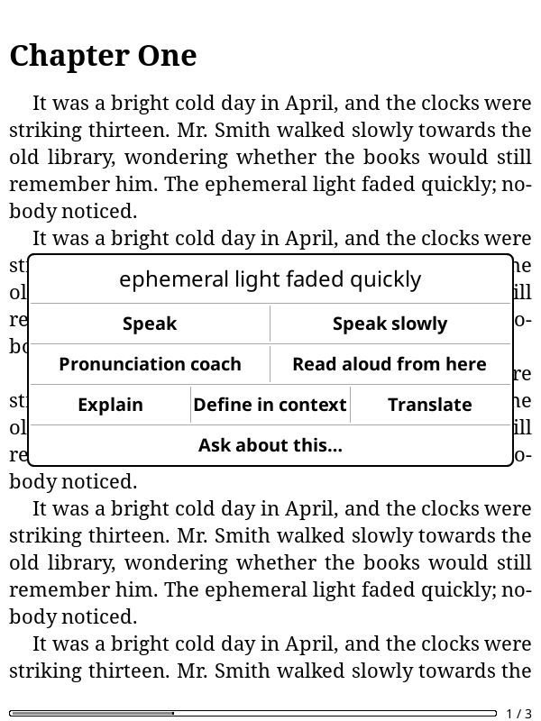
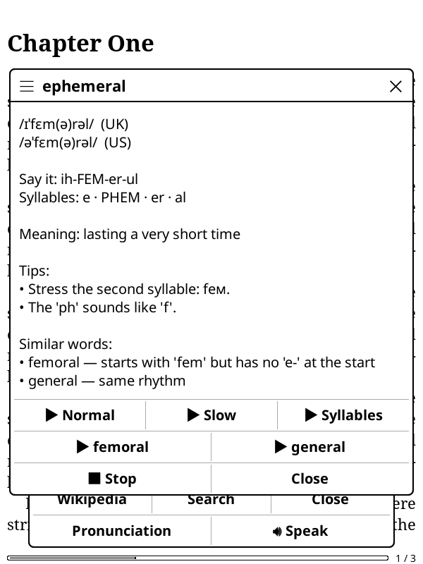
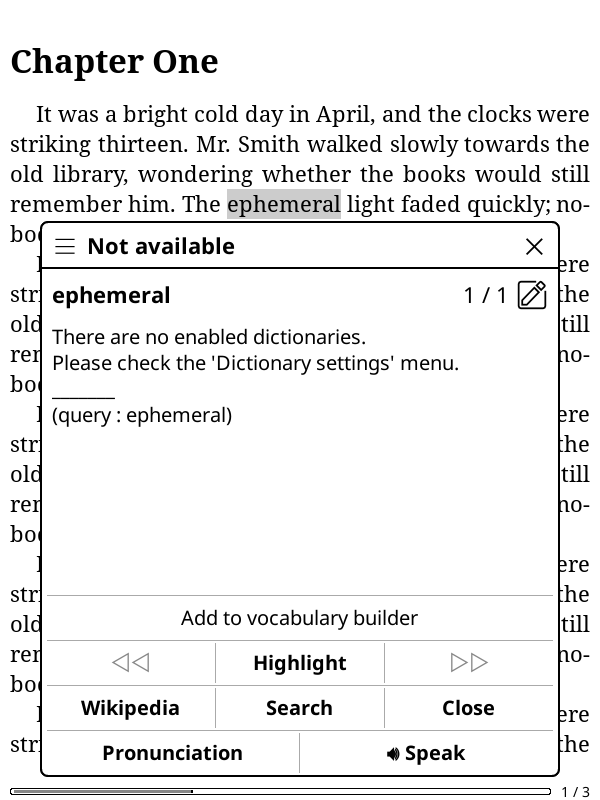

# Voice Companion for KOReader

Hear what you read. Voice Companion is a [KOReader](https://github.com/koreader/koreader) plugin that adds AI and device voices to your e-reader:

- **Speak** any word or passage, normally or slowly.
- **Pronunciation coach**: IPA, an easy respelling, syllables and stress, tips, and similar-sounding words, each with a play button. No microphone needed.
- **Explain by voice**: explain a passage, define a word in context, translate, summarize the page, or ask your own question. The answer is shown and read aloud, and you can ask follow-ups.
- **Read the book aloud** from the current page, a selection or a looked-up word. Sentences are sent in groups of about 300 characters (adjustable), the group being read is highlighted, the page turns as the reading reaches it, and you can pause, resume and stop.

It works with **any OpenAI-compatible API**, including [OpenRouter](https://openrouter.ai), OpenAI, Groq and self-hosted servers such as Kokoro-FastAPI. It can also use the **device's own text-to-speech** offline at no cost.

| Selection → Voice… | Pronunciation coach | Explanation |
|---|---|---|
|  |  |  |

| Dictionary popup | Reading aloud |
|---|---|
|  |  |

## Supported devices

| Platform | Cloud (AI) voices | Device voice | Notes |
|---|---|---|---|
| Android (e.g. Boox, Onyx, Tolino with KOReader APK) | ✓ | ✓ Android text-to-speech | Uses a TTS engine installed in Android settings |
| Linux desktop KOReader | ✓ | ✓ espeak-ng, piper, or any command | Needs `mpv`, `ffplay`, `paplay` or `aplay` |
| Kobo, Kindle, PocketBook | — | — | Not yet; contributions welcome |

Reading aloud works with reflowable books: EPUB, FB2, MOBI, HTML and TXT. Speak, the coach and explanations work in any document where you can select text.

## Install

1. Download `voicecompanion.koplugin.zip` from [Releases](../../releases), or clone this repository.
2. Copy the `voicecompanion.koplugin` folder into KOReader's `plugins` folder:
   - Android: `/sdcard/koreader/plugins/`
   - Linux: `~/.config/koreader/plugins/`
3. Restart KOReader.

## Set up

### AI voices and explanations

You need an API key. With [OpenRouter](https://openrouter.ai/keys), one key covers both the voices and the chat model.

**Option A — on the device:** Tools → **Voice Companion → Settings → API key**.

**Option B — configuration file:** copy `configuration.sample.lua` to `configuration.lua` in the plugin folder and edit it on a computer. Every option is explained in the sample. The minimum is:

```lua
return {
    providers = { openrouter = { api_key = "sk-or-v1-…" } },
}
```

Defaults:

| Setting | Default |
|---|---|
| Speech model | `hexgrad/kokoro-82m` (natural, 8 languages, about $0.62 per million characters) |
| Voice | `af_heart` |
| Chat model | `google/gemini-3.8-flash` |

Changing a setting in the menu writes `configuration.lua` for you. The menu rewrites the whole file, so values are kept but your comments are lost. `configuration.lua` is git-ignored and never overwritten by updates.

### Device voice (offline)

Settings → **Default voice → Device voice**.

- **Android:** install and select a voice in Android's *Settings → Text-to-speech*. Google, Samsung and RHVoice all work. Then set **Device voice language** (e.g. `en-US`).
- **Linux:** install `espeak-ng`, or set `local_tts.command` to any command that writes a WAV file (for example piper).

You can also mix voices: in `configuration.lua`, set `pronounce.engine`, `read_aloud.engine` or `voice_engine` to `"cloud"` or `"local"`.

## Use

| Where | What |
|---|---|
| Select text → **Speak** | Read the selection aloud |
| Select text → **Voice…** | Speak slowly, Pronunciation coach, Read aloud from here, Explain, Define in context, Translate, Ask about this… |
| Dictionary popup → **🔊 Speak** / **Pronunciation** / **▶ Read from here** | Hear a word you looked up (long-press 🔊 for slow), or start reading the book at it |
| Playback bar | While anything is spoken, a small bar at the bottom of the page shows *Loading voice… / Reading / Paused* with **Pause/Resume** and **Stop** |
| Tools → **Voice Companion** | Read aloud from this page, Pause/Resume, Stop, Summarize this page, Ask about the book, Settings, Diagnostics |
| Gestures | *Voice Companion: read aloud / pause-resume / stop / summarize* in KOReader's gesture manager |

Audio is cached on the device (50 MB by default), so replaying a word or sentence costs nothing.

## Privacy and cost

- With cloud voices, the text being spoken is sent to your provider. Explanations also send up to `explain.max_context_chars` characters (6000 by default) of the surrounding book text. Nothing is sent anywhere else.
- The device voice sends nothing over the network.
- You pay your provider directly. A typical novel read aloud with Kokoro costs well under $1.

## Troubleshooting

**Tools → Voice Companion → Diagnostics** runs each part on its own:

- configuration
- background requests
- audio player (a test beep)
- cloud voice
- device voice

Each voice request's timing (request start, how long it took, playback start and end, and the gap between items) is written to `koreader/cache/voicecompanion/timing.log`. It helps when speech is slow to start or pauses between sentences.

AI voices (Gemini TTS in particular) generate each request independently, so the tone can shift between requests. Larger groups under **Settings → Reading aloud → Text per request** reduce this; Kokoro keeps a steady voice even sentence by sentence.

Before each test starts, a line is written to `koreader/cache/voicecompanion/diagnostics.log`. If KOReader ever closes during a test, the Diagnostics menu shows **"⚠ Last run stopped during: …"** next time. Please include that in a bug report.

Common issues:

| Symptom | Fix |
|---|---|
| "No API key for provider" | Add the key in Settings or `configuration.lua` |
| `HTTP 404 … check the model name` | The model ID is wrong or not available from your provider |
| `HTTP 400 … only supports response_format="pcm"` (e.g. Gemini TTS) | Settings → **Audio format → pcm**, and set a voice the model supports |
| Cloud voice speaks too fast or slow | Only with `audio_format = "pcm"`: set `sample_rate` to match your model |
| Device voice: "did not start" | Install or select a TTS engine in Android settings |
| Android device voice can't pause | Android's speech engine has no pause, so pausing stops and resuming restarts the sentence |

## How it works

- No helper `.dex` and no native binaries. On Android, the plugin calls `TextToSpeech` and `MediaPlayer` directly through JNI. Every call is typed and exception-checked, so a Java error becomes a message instead of a crash.
- Network requests run in a background process, so the reader never freezes.
- Book sentences are built from KOReader's own word positions, so highlights line up exactly with the text on screen.

## Development

```sh
luajit spec/run.lua     # unit tests with KOReader stubs
luacheck .              # lint
tools/package.sh        # builds dist/voicecompanion.koplugin.zip
```

The code layout:

| Path | Contents |
|---|---|
| `main.lua` | Entry points |
| `voicecompanion/voice.lua` | Plays any text (cloud/local, cache, lookahead) |
| `voicecompanion/features/` | Speak, coach, explain, read-aloud |
| `voicecompanion/tts/`, `voicecompanion/audio/` | Engines and players |
| `voicecompanion/jni.lua` | Safe JNI bridge |

## License

GPL-3.0-or-later. See [LICENSE](LICENSE).
